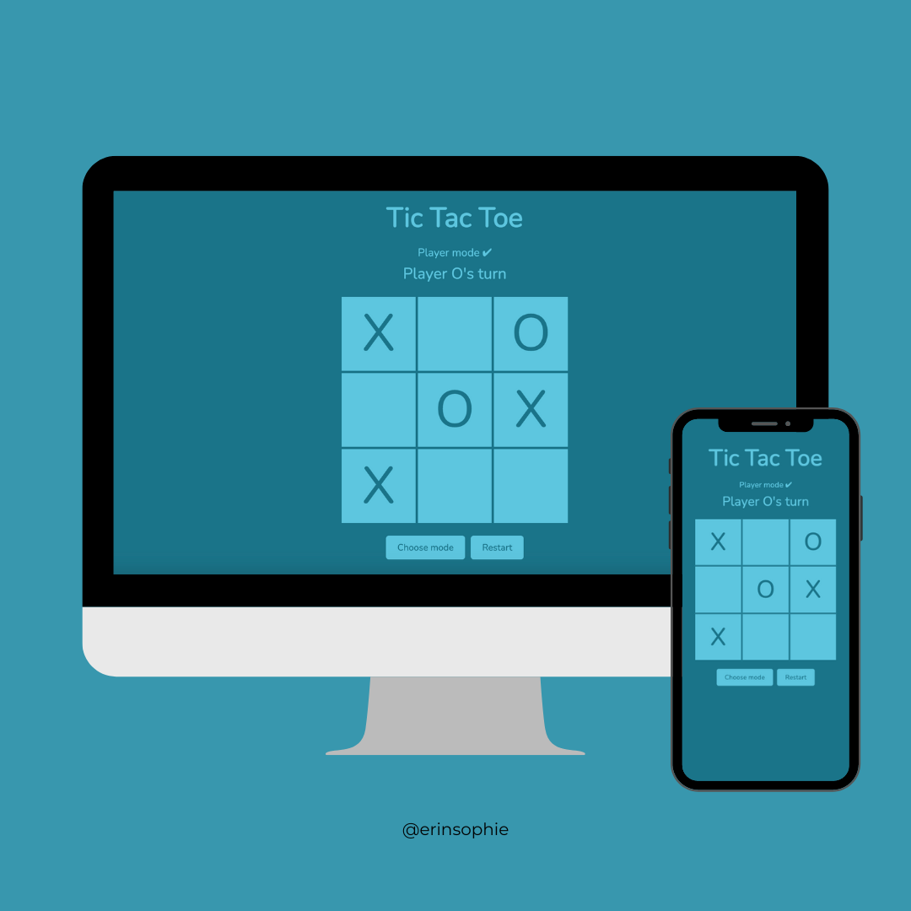

# Tic-Tac-Toe

## [Live Demo](https://erinsophie.github.io/Tic-Tac-Toe/)

# Technologies Used 

- HTML
- CSS
- Javascript

# Project goals

- This project was intended to demonstrate newly-learnt knowledge of factory functions, modules and closure
- The main goal was to have as little globally-scoped variables as possible
- This project uses no globally-scoped variables - instead, they are tucked isnide of factory functions or a module
- Throughout this project I learnt how to create public and private scope even though Javascript does not have a built-in mechanism for it, you can still create the illusion with closures, which shows how powerful they are
- Using a design pattren for the first time forced me to think about how I am going to structure my code in a very different way than before
- I think my code could be cleaner and have less repitition but that's something I am still learning and want to improve on!
- This has made me really think about how I am going to plan out my projects from now on
- I feel like I have more of an understanding of the ways Javascript differs from other programming languges

